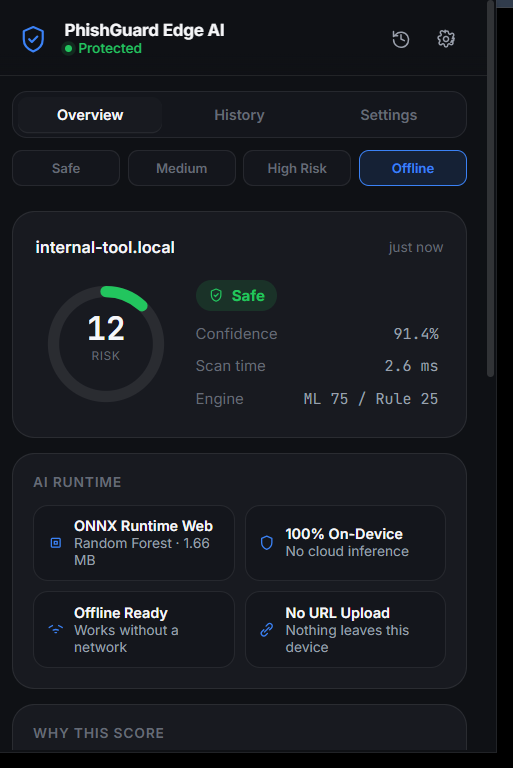
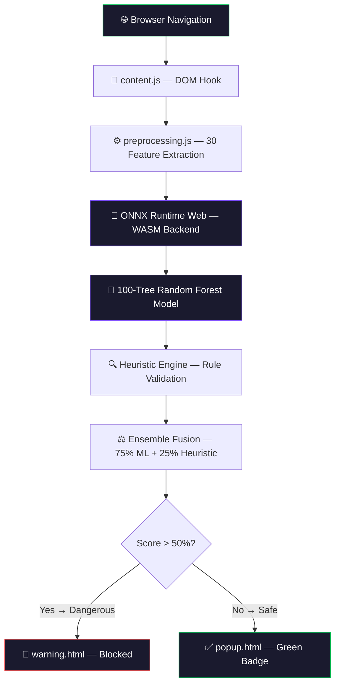
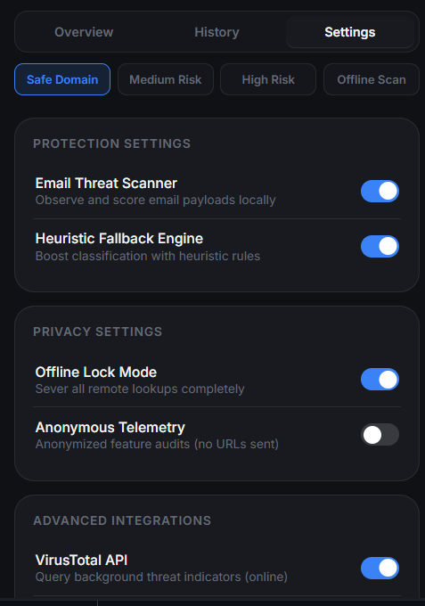
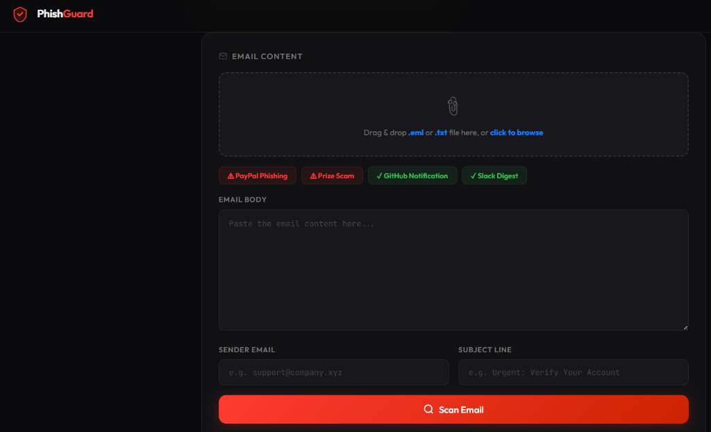
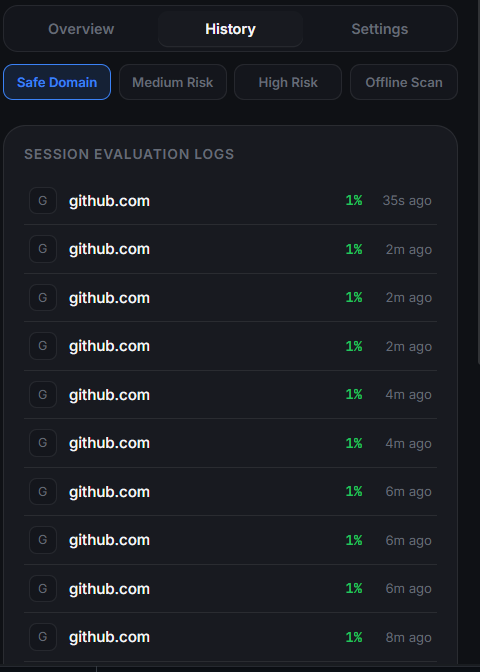
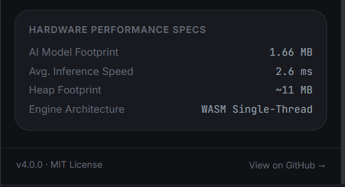

# 🛡️ PhishGuard Edge AI

### Real-Time Phishing Detection — 100% On-Device, Zero Cloud, Fully Offline

<p align="center">
  
</p>

<p align="center">
  
  
  
  
</p>

<p align="center">
  
  
  
  
  
</p>

---

## ⚡ The Problem

Every day, **3.4 billion phishing emails** are sent worldwide. Traditional browser security tools protect you by uploading every URL you visit to cloud servers — creating a **complete browsing history** on someone else's infrastructure.

**PhishGuard Edge AI solves this by running AI inference entirely inside your browser.** No URLs leave your device. No cloud servers are contacted. It works offline, in airplane mode, even without an internet connection.

---

## 🆚 Why On-Device AI?

Traditional security models compromise user privacy by sending private browsing histories to remote databases. PhishGuard brings the AI runtime directly to the source.

```
[Traditional Browser Protection]
   Browser  ──>  Cloud API (onrender.com, vt.com)  ──>  Inference  ──>  Result
   (Uploads all your visited URLs, search queries, and credentials context)

[PhishGuard Edge AI]
   Browser  ──>  ONNX Runtime Web (WASM + SIMD)    ──>  Local AI   ──>  Result
   (100% on-device containment. Zero data leaves your computer. Works offline)
```

---

## 🧠 How It Works

PhishGuard compiles a trained Random Forest classifier into an **ONNX model** that runs via **WebAssembly** directly in Chrome's service worker. When you navigate to any webpage:

1. **Feature Extraction** — 30 URL features are extracted locally (length, entropy, subdomain count, brand spoofing patterns, etc.)
2. **ONNX Inference** — The model runs via `ort.InferenceSession` in the WASM backend — **< 5ms**
3. **Heuristic Fusion** — Rule-based checks (homograph attacks, suspicious TLDs, encoded characters) are combined with the ML score using a **75/25 ensemble**
4. **Instant Decision** — Safe pages get a green badge. Dangerous pages are **immediately blocked** before they can load

```
┌─────────────────────────────────────────────────────────────────┐
│                    YOUR BROWSER (Chrome)                        │
│                                                                 │
│  URL → [Feature Extraction] → [ONNX WASM Runtime] → Score      │
│          30 features              100 decision trees            │
│              ↓                          ↓                       │
│       [Heuristic Engine]      [ML Probability 0-1]              │
│              ↓                          ↓                       │
│           [Ensemble Fusion: 75% ML + 25% Heuristic]             │
│                          ↓                                      │
│              Score > 0.50 → ⚠️ BLOCKED                          │
│              Score < 0.30 → ✅ SAFE                              │
│                                                                 │
│  ❌ No URLs sent to cloud    ❌ No API keys needed               │
│  ✅ Works offline            ✅ Zero network requests            │
└─────────────────────────────────────────────────────────────────┘
```

---

## 🏗️ Architecture



---

## 📸 Screenshots

| Overview Dashboard | Warning Page | Email Scanner |
|---|---|---|
|  |  |  |

| Scan History | Performance |
|---|---|
|  |  |

---

## 🕹️ 3-Minute Demo Flow

This demo proves the core thesis: **AI runs locally, works offline, zero cloud dependency.**

| Step | Action | Expected Result |
|------|--------|-----------------|
| 1 | Open PhishGuard extension | Dashboard loads, green "Protected" status |
| 2 | Navigate to `google.com` | ✅ **Safe** — green gauge, low risk score |
| 3 | Navigate to a suspicious URL | 🚫 **Blocked** — warning page with XAI reasons |
| 4 | **Disconnect Wi-Fi** | Extension still shows "Protected" |
| 5 | Navigate to `github.com` (offline) | ✅ **Safe** — proves offline inference works |
| 6 | Show Settings → "On-Device AI Architecture" | Cloud API Calls: **0**, Engine: **WASM + SIMD** |
| 7 | Show Performance Metrics | Inference time, model size, zero network requests |

> **Key moment:** Steps 4-5 prove the AI runs entirely on-device. This is the story that wins.

---

## 📊 Performance

| Metric | Value |
|--------|-------|
| **Inference Latency** | < 5 ms (WASM + SIMD) |
| **Model Size** | 4.4 MB (ONNX compiled) |
| **WASM Heap** | ~11 MB |
| **Feature Extraction** | < 1 ms |
| **URL Features** | 30 numerical features |
| **Email Features** | 28 features |
| **Decision Trees** | 100 (RandomForest) |
| **External API Calls** | **0** |
| **Data Sent to Cloud** | **None** |
| **Offline Support** | **Full** |

---

## 🔒 Privacy by Design

| Principle | Implementation |
|-----------|---------------|
| **No URL Transmission** | URLs are processed in temporary runtime variables. Never sent anywhere. |
| **No Cloud Inference** | ONNX model executes in WebAssembly. No server round-trips. |
| **No API Keys Required** | Extension works out of the box with zero configuration. |
| **Offline Operation** | Full protection without internet. Airplane mode compatible. |
| **Local-Only Storage** | Scan history stored in `chrome.storage.local`. Exportable. Deletable. |
| **Open Source** | Every line of inference code is auditable. No obfuscation. |

---

## 🧠 Explainable AI (XAI)

PhishGuard doesn't just say "blocked" — it tells you **why**:

- **🔢 Shannon Entropy** — Flags randomly-generated hostnames (DGA detection)
- **🏷️ Brand Impersonation** — Detects brand names on unofficial domains (`paypal-secure.xyz`)
- **🔗 Homograph Attacks** — Catches Punycode (`xn--`) and lookalike characters (`0→o`, `1→l`)
- **🌐 Suspicious TLDs** — Flags high-risk extensions (`.xyz`, `.tk`, `.ml`, `.club`)
- **📧 Email Threats** — Analyzes urgency language, mismatched links, spoofed senders
- **🔀 Redirect Detection** — Identifies URL redirect parameters and double-slash techniques

Each indicator is shown in the popup with its contribution weight, so users understand the reasoning.

---

## 📥 Installation

1. **Clone** this repository:
   ```bash
   git clone https://github.com/manojprasad-dot/hackathon-project.git
   ```

2. Open Chrome and navigate to `chrome://extensions/`

3. Enable **Developer mode** (top-right toggle)

4. Click **Load unpacked** → select the `extension/` folder

5. The PhishGuard shield icon appears in your toolbar — you're protected.

> No build step. No npm install. No API keys. Just load and go.

---

## 📂 Project Structure

```
hackathon-project/
│
├── extension/                        ← Chrome MV3 Extension (load this)
│   ├── manifest.json                 ← Extension configuration
│   ├── background.js                 ← Service worker (URL monitoring + ONNX inference)
│   ├── content.js                    ← Content script (warning redirects)
│   ├── popup.html / popup.css / popup.js  ← Dashboard UI
│   ├── warning.html / warning.css / warning.js  ← Block page
│   ├── email_scanner.html / .js      ← Email threat scanner
│   ├── gmail_scanner.js              ← Gmail/Outlook DOM observer
│   ├── report.html                   ← Threat reporting (local storage)
│   │
│   └── ai/                           ← On-Device AI Bundle
│       ├── model.onnx                ← 4.4 MB URL phishing model (100 trees)
│       ├── email_model.onnx          ← 138 KB email phishing model
│       ├── ort.min.js                ← ONNX Runtime Web engine
│       ├── ort-wasm.wasm             ← Standard WASM binary
│       ├── ort-wasm-simd.wasm        ← SIMD-accelerated WASM binary
│       ├── preprocessing.js          ← 30-feature URL extractor
│       ├── email_preprocessor.js     ← 28-feature email extractor
│       └── predictor.js              ← Inference + heuristic ensemble
│
├── backend/                          ← Training pipeline (offline, not deployed)
│   ├── ml/
│   │   ├── train_model.py            ← URL model training script
│   │   ├── train_local_datasets.py   ← Multi-dataset training pipeline
│   │   ├── train_email_model.py      ← Email model training script
│   │   ├── convert_to_onnx.py        ← sklearn → ONNX conversion
│   │   └── detector.py               ← Reference heuristic rules
│   └── features/
│       └── extractor.py              ← Python feature extractor (reference)
│
├── docs/
│   ├── TECHNICAL.md                  ← Mathematical formulations
│   ├── demo/screenshots/             ← Demo assets
│   └── images/                       ← README screenshots
│
├── SECURITY.md                       ← Security policy
├── LICENSE                           ← MIT License
└── README.md                         ← This file
```

---

## 🛠️ Tech Stack

| Layer | Technology |
|-------|-----------|
| **Browser Extension** | Chrome Manifest V3 API |
| **AI Runtime** | ONNX Runtime Web 1.17.3 (WebAssembly + SIMD) |
| **Model** | Scikit-learn RandomForest → ONNX |
| **Training** | Python, Scikit-learn, skl2onnx |
| **UI** | HTML5, CSS Custom Properties, Vanilla JavaScript |
| **Data** | PhishTank, Tranco Top 1M, PhiUSIIL Dataset |

---

## 🤖 Model Training

The URL model was trained on **60,000 balanced URLs** (30K phishing + 30K safe) from:
- **PhishTank** verified phishing URLs
- **Tranco Top 1M** safe domains
- **PhiUSIIL** phishing URL dataset

Training script: [`backend/ml/train_local_datasets.py`](backend/ml/train_local_datasets.py)

```
RandomForest: 100 trees, max_depth=15, min_samples_split=5
Validation Accuracy: ~95%
ONNX Export: skl2onnx with zipmap=False, opset=17
```

---

## 🗺️ Roadmap

- [ ] **WebGPU Acceleration** — Fallback path for larger model architectures
- [ ] **Firefox & Safari Ports** — WebExtensions and Safari web extensions
- [ ] **Federated Learning** — Local model tuning from user feedback
- [ ] **Expanded Heuristics** — Emerging obfuscation pattern detection

---

## 📄 License

MIT License. See [LICENSE](LICENSE) for details.

---

## 💖 Acknowledgements

- **ONNX Runtime Team** for the WebAssembly inference engine
- **Chrome Extensions Team** for Manifest V3 documentation
- **Scikit-learn Contributors** for the model training framework
- **PhishTank, Tranco, PhiUSIIL** for open datasets
