# 🛡️ PhishGuard Edge AI

### Next-Generation, 100% On-Device Phishing Detection Running Locally in the Browser

<p align="center">
  
</p>

<p align="center">
  
  
  
  
  
  
  
  
  
</p>

---

## ⚡ Elevator Pitch

PhishGuard Edge AI is a high-performance web browser security extension that detects phishing attacks **entirely on-device**. By compiling a 100-tree Random Forest classifier into an optimized WebAssembly runtime, it extracts URL and email features and executes predictions locally within **2.6 milliseconds**. Unlike traditional security tools that track your browsing history by uploading URLs to third-party cloud APIs, PhishGuard Edge AI operates with zero network requests, keeping your browsing metadata completely private and secured—even when offline.

---

## ⚖️ Why This Project?

Traditional browser security tools rely on cloud lookups. This architecture introduces a fundamental trade-off between user privacy, page-load latency, and operating costs. PhishGuard Edge AI breaks this compromise.

### Comparison Matrix

| Metric / Capability | Traditional Cloud Protection | PhishGuard Edge AI |
| :--- | :--- | :--- |
| **Data Privacy** | ❌ URLs uploaded to cloud servers | **✓ 100% Local (zero data leaves device)** |
| **Inference Latency** | ❌ `150ms - 300ms` (network dependent) | **✓ `2.6ms` (synchronous WASM execution)** |
| **Offline Protection** | ❌ Disabled without internet | **✓ Fully Operational** |
| **Explainable AI (XAI)** | ❌ Binary "Safe/Unsafe" block screens | **✓ Full indicator weight breakdown** |
| **Hosting Costs** | ❌ Dynamic server scaling fees | **✓ $0.00 Serverless client footprint** |

---

## ✨ Core Features

*   **🛡️ Real-Time Detection**: Dynamic protection hooks into navigation loops to block malicious links before they load.
*   **⚡ ONNX Runtime Web**: Leverages client-side WebAssembly SIMD kernels to run machine learning models.
*   **🔒 100% Local AI**: Zero external API dependencies for evaluation, protecting your browsing metadata.
*   **🌐 Offline Ready**: Performs feature extraction and classifications without an active internet connection.
*   **📧 Email Threat Scanner**: Standardized parser that analyzes Gmail and Outlook DOM structures for phishing indicators.
*   **🧠 Explainable AI**: Visualizes model features, weights, and triggers so you know *why* a page was blocked.
*   **📊 Dynamic Risk Gauge**: Premium Apple-inspired circular UI reporting score percentiles and risk profiles.
*   **🚀 Ultra-Low Latency**: Highly-pruned model nodes execute in less than 3 milliseconds.
*   **🔍 Heuristic Fallback Engine**: Merges statistical tree predictions with structural rule matchers.
*   **📦 Open Source**: Built entirely with transparent, readable open source code.

---

### 📊 Overview Dashboard


### 📧 Email Threat Scanner


### ⚙️ Protection & Privacy Settings


### 📜 Session Evaluation Logs


### ⚡ Hardware Performance Specs


---

## 🕹️ Demo Scenarios

PhishGuard Edge AI includes a visual **Demo Sandbox** built directly into the header of the popup panel. Click these buttons to test the engine's behavior:
1.  **Safe Domain**: Simulates navigating to a trusted host (e.g., Google). Renders green indicators showing HTTPS alignment and domain age.
2.  **Medium Risk**: Evaluates a subdomain with keyword anomalies. Renders warning alerts with moderate threat weights.
3.  **High Risk**: Simulates a credential harvester (IP host). Redirection logic intercepts the page and routes to the warning page.
4.  **Offline Scan**: Simulates total network disconnection. Renders purely local rule evaluations.

---

## 🏗️ Technical Architecture

The diagram below maps the runtime lifecycle from initial tab redirection to model evaluation:

```mermaid
graph TD
    A[Browser Navigation] --> B[content.js / DOM Hook]
    B --> C[Feature Extraction preprocessing.js]
    C --> D[ort.min.js WebAssembly Heap]
    D --> E[100-Tree Random Forest Model]
    E --> F[Heuristics Engine]
    F --> G[Risk Fusion Engine predictor.js]
    G --> H{Score > 65%?}
    H -- Yes --> I[warning.html Interception Screen]
    H -- No --> J[popup.html Overview Card]
```



---

## ⚙️ How It Works

1.  **Feature Extraction**: On every page load, [preprocessing.js](extension/ai/preprocessing.js) parses the URL into a 30-feature numerical array. It measures structural indicators like length, subdomains, special character counts, and hostname entropy.
2.  **ONNX WebAssembly Execution**: [ort.min.js](extension/ai/ort.min.js) boots the compiled `model.onnx` using single-threaded WASM.
3.  **Random Forest Classification**: The model processes the 30-feature vector across 100 decision trees to determine the probability of a threat.
4.  **Heuristics Calibration**: A rule engine validates checks (like homograph character spoofs or non-HTTPS password inputs) that standard ML features might miss.
5.  **Ensemble Risk Fusion**: [predictor.js](extension/ai/predictor.js) fuses ML probabilities with heuristic outcomes (75% ML / 25% Heuristics) to generate the final classification. Detailed math derivations are in [docs/TECHNICAL.md](docs/TECHNICAL.md).

---

## 📊 Performance Benchmarks

All metrics reflect averages recorded across 10,000 evaluations on standard consumer hardware:

*   **Inference Latency**: `2.6 ms` (WASM SIMD) / `3.8 ms` (Standard WASM)
*   **WASM Memory Footprint**: `~11 MB`
*   **Total Local Bundle Size**: `21.2 MB` (includes ONNX WASM runtimes)
*   **Model Parameter Size**: `1.66 MB`
*   **Average Preprocessing Time**: `0.3 ms`
*   **External API Sockets**: `0`

---

## 🤖 AI Model & Training Pipeline

*   **Dataset Source**: Trained on a balanced set of 50,000 URLs consisting of malicious domains (PhishTank) and safe URLs (Alexa Top 1M).
*   **Training Script**: Orchestrated via [train_model.py](backend/ml/train_model.py).
*   **Tree Depth Pruning**: The Random Forest classifier was limited to a max depth of `15` levels. This reduced the compiled binary size from `10.7 MB` to **`1.66 MB`**, making it lightweight enough to run in browser background workers.
*   **Parity Verification**: [convert_to_onnx.py](backend/convert_to_onnx.py) verifies that the exported JS model outputs match the original Scikit-Learn predictions within $10^{-7}$ precision.

---

## 🧠 Explainable AI (XAI) Indicators

PhishGuard displays the reasoning behind its safety decisions:
*   **Entropy Check**: Identifies randomized hostnames using Shannon entropy equations (see [docs/TECHNICAL.md](docs/TECHNICAL.md)).
*   **Top Level Domain (TLD) Check**: Flags extensions often used for malicious redirects (e.g., `.club`, `.work`).
*   **Homograph Protection**: Scans for Punycode strings (`xn--`) used to spoof legitimate brand names.
*   **Keyword Scan**: Flags subdomains containing terms like `secure`, `signin`, or `verify` combined with unofficial hostnames.

---

## 🔒 Privacy by Design

*   **No URL Transmission**: Hostnames are processed locally in temporary runtime variables and are never sent to external servers.
*   **Offline Operation**: You remain protected without an internet connection.
*   **Zero Logs Storage**: Scan records are stored on your local device in `chrome.storage.local` and can be cleared or exported at any time.

---

## 📥 Installation & Setup

1.  Clone this repository to your local machine:
    ```bash
    git clone https://github.com/manojprasad-dot/hackathon-project.git
    ```
2.  Open Google Chrome and navigate to:
    ```
    chrome://extensions/
    ```
3.  Enable **Developer mode** using the toggle switch in the top-right corner.
4.  Click the **Load unpacked** button in the top-left corner.
5.  Select the **`extension/`** folder inside this repository.
6.  The PhishGuard icon will appear in your browser toolbar.

---

## 📂 Project Structure

```
phishguard/
│
├── extension/                        ← Chrome MV3 Extension Root
│   ├── manifest.json                 ← Manifest configuration (CSP details)
│   ├── background.js                 ← SW controller (URL monitor, IPC interface)
│   ├── content.js                    ← Content script (warning redirects)
│   ├── warning.html / warning.css    ← Interception page layout
│   ├── warning.js                    ← Warning page query parameter parser
│   ├── email_scanner.html / .js      ← Standalone Email Scanner View
│   ├── gmail_scanner.js              ← Gmail/Outlook DOM observer
│   │
│   └── ai/                           ← On-Device AI Bundle
│       ├── model.onnx                ← 1.66MB Compiled URL Model (100 Trees)
│       ├── email_model.onnx          ← 138KB Compiled Email Model
│       ├── ort.min.js                ← ONNX Runtime Web engine
│       ├── ort-wasm.wasm             • Standard WASM binary
│       ├── ort-wasm-simd.wasm        • SIMD WASM binary
│       ├── preprocessing.js          ← 30-Feature URL preprocessor
│       ├── email_preprocessor.js     ← 28-Feature Email preprocessor
│       └── predictor.js              ← ONNX Inference & Heuristics fusion
│
└── backend/                          ← Offline Python training pipeline
    ├── app.py                        ← Legacy endpoint & local verification server
    ├── requirements_train.txt        ← ML/ONNX export dependencies
    ├── features/
    │   └── extractor.py              ← Reference feature extraction
    └── ml/
        ├── train_model.py            ← Balanced 50K URL training script
        ├── detector.py               ← Reference heuristic rules
        └── model.pkl                 ← Legacy scikit-learn format
```

---

## 🛠️ Tech Stack

*   **Browser Extensions**: Google Chrome MV3 API
*   **Machine Learning Runtime**: ONNX Runtime Web (WASM + SIMD)
*   **Model Training**: Python, Scikit-learn, ONNX
*   **Interface**: HTML5, Vanilla CSS (Modern CSS Custom Variables)

---

## 🗺️ Roadmap

*   [ ] **WebGPU Acceleration**: Add WebGPU fallback paths for executing larger model architectures.
*   [ ] **Firefox & Safari Ports**: Port the MV3 API wrapper to run on WebExtensions and Safari web extensions.
*   [ ] **Federated Learning**: Enable secure local model tuning based on user feedback without sharing user data.
*   [ ] **Expanded Local Heuristics**: Expand local checks to identify emerging obfuscation patterns.

---

## 🤝 Contributing

Contributions to PhishGuard Edge AI are welcome! Please follow these guidelines:
1.  Fork the repository and create your feature branch: `git checkout -b feature/your-feature`.
2.  Commit your changes following standard guidelines.
3.  Submit a pull request to the `on-device-ai` branch for review.

---

## 📄 License

This project is licensed under the MIT License. See the [LICENSE](LICENSE) file for details.

---

## 💖 Acknowledgements

*   **ONNX Runtime Team** for the client-side WebAssembly execution engine.
*   **Chrome Extensions Documentation** for details on Manifest V3 migrations.
*   **Scikit-learn Contributors** for the model training toolkits.
*   **The Open Source Community** for tools and support.
